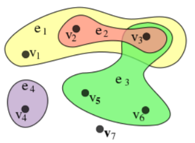
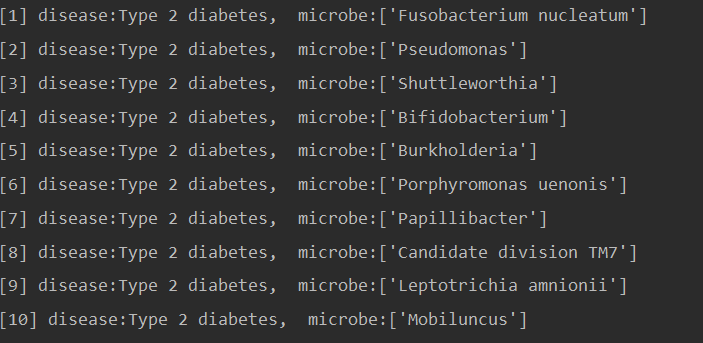

# &emsp;&emsp;&emsp;&emsp;&emsp;&emsp;&emsp;&emsp;超图上的随机游走

### &emsp;&emsp;&emsp;&emsp;&emsp;&emsp;&emsp;&emsp;&emsp;&emsp;&emsp;&emsp;&emsp;&emsp;&emsp;&emsp;摘要

&emsp;&emsp;图有着高度概括性的结构，常被用于研究对象之间的关系；简单图上的随机游走作为图论与概率论的交叉领域，也有着丰富的理论与应用成果，被广泛应用在排序、推荐系统、聚类分析等领域。但是简单图的局限性在于它无法表示更高阶的关系，因此有必要对简单图做出推广，引入超图上及超图上的随机游走。

&emsp;&emsp;本文从简单图出发，通过类比的方式给出超图的定义；并讨论了不同情形下的随机游走，进而引出超图上的随机游走。接着，我们将PageRank算法作为随机游走的一个应用，对其进行了简单介绍；同时指出，PageRank算法并不能直接应用于实际生活，需要将其进行改进，从而有了重启随机游走。文章的最后一部分使用重启随机游走算法对文献RWHMDA: Random Walk on Hypergraph for Microbe-Disease Association Prediction进行了复现。

**关键词：超图&emsp;&emsp;随机游走&emsp;&emsp;重启随机游走**

### 1.超图

####1.1简单图

&emsp;&emsp;在离散数学中，一个很重要的概念就是“图”。图可以简单地定义为顶点和边的有序二元组，顶点之间通过边来关联，它可以很好地描述对象与对象之间的数学关系。

&emsp;&emsp;但是从图的定义可以看出，它只能表示任意两个顶点之间的关系，对于两个以上顶点之间的关联则无能为力，由此我们引入的超图可以很好地解决这个问题。

#### 2.2超图

符号声明：

|      符号       |      含义      |
| :-----------: | :----------: |
|      $V$      |    超图中的点集    |
| $\mathcal{E}$ | 超图中所有超边构成的集合 |
|      $v$      |    超图中的一点    |
|      $e$      |   超图中的一条超边   |
|    $w(e)$     |   超边$e$的权重   |
|      $H$      |   超图的关联矩阵    |
|      $A$      |   超图的邻接矩阵    |
|     $D_v$     | 无权重超图中顶点的度矩阵 |
|     $D_e$     | 有权重超图中超边的度矩阵 |

- 定义1：由点集$V$和超边集$\mathcal{E}$组成的二元有序组$HG(V,\mathcal{E})$称为超图。超边$e$是$V$的一个子集，满足$\cup_{e\in \mathcal{E}}e=V$。如果超边带有权重$w$，则超图称为带权重的超图$HG(V,\mathcal{E},w)$。

**&emsp;&emsp;从定义可以看出，点集$V$与简单图并无差异，唯一不同的是对于边的定义：在超图中，边不再是连接两个顶点的线段，而变成了$V$的一个子集，即超边也是一个点集。**下图可以直观地解释超图的定义：

&emsp;&emsp;进而可以定义“连通图”、“路”、“连接”的概念。

- 定义2：通过超边连接起来的有序点以及这些超边构成路。

&emsp;&emsp;**例如在上图中，$\{v_1,e_1,v_2,e_2,v_3,e_3,v_5\}$就构成一条路，因为$v_1$和$v_2$通过$e_1$连接，$v_2$和$v_3$通过$e_2$连接，$v_3$和$v_5$通过$e_3$连接，从而构成一条路。**

- 定义3：如果$v\in e$，则称超边$e$连接$v$。

&emsp;&emsp;因为超边也是点集，所以如果某个点$v$属于点集$e$，就如此定义。在上图中，$e_2$和$e_3$都连接$v_3$。

- 定义4：超图的关联矩阵如下定义：

$H\in \mathcal{R}^{|V|\times|\mathcal{E}|}$，其中$H$的元素$h(v, e)=\left\{\begin{array}{ll}1 & \text { if } v \in e \\ 0 & \text { if } v \notin e\end{array}\right.$。

&emsp;&emsp;可以看出，关联矩阵$H$以点为行，以超边为列；如果第$i$个点在第$j$个超边中，则矩阵对应元素为1，否则为0。

- 定义5：点$v$和超边$e$的度分别定义如下：

$\begin{aligned} d(v) &=\sum_{e \in \mathcal{E}} w(e) h(v, e) \\ \delta(e) &=\sum_{v \in V} h(v, e)=|e| \end{aligned}$

&emsp;&emsp;**可以如下理解：点的度就是有多少个超边包含它，而超边的度就是它包含了多少个点，对于有权重的图只需乘上相应的权重即可。**

&emsp;&emsp;综上我们完成了对超图的定义，曾经有人提出可以把超图以某种方式简化，当作简单图来看待，但这势必会造成信息的损失。下面这个例子可以很好地解释这一点：如果把全校的教职员工看作点，把他们的部门关系看作超边，那么一个教职工可以隶属于许多部门，此时只需要使代表该教职工的点属于这些超边即可；但如果把超图简化成了简单图，我们只能知道任意两个教职工是否都属于同一个部门，而不能知道具体是哪个部门。

### 2.随机游走

&emsp;&emsp;随机游走可以简单地理解为这样一个过程：在固定的时间$t$内，从一个给定的点出发，沿着边移动到另外一个相邻的点。在讨论随机游走之前，先来看一下与其密切相关的马尔可夫过程。

#### 2.1马尔可夫过程

- 定义：设$\{X(t),t\in T\}$为一随机过程，$E$为其状态空间，若对任意的$t_1<t2< ...t_n<t$，$x_1,x_2...x_n,x\in E$，随机变量$X(t)$在已知变量$X(t_1)=x_1...X(t_n)=x_n$之下的条件分布函数只与$X(t_n)=x_n$有关，而与$X(t_1)=x_1...X(t_{n-1})=x_{n-1}$无关，即条件分布函数满足等式：

$$P\left\{X(t) \leqslant x | X\left(t_{n}\right)=x_{n}, \cdots, X\left(t_{1}\right)=x_{1}\right\}=P\left\{X(t) \leqslant x | X\left(t_{n}\right)=x_{n}\right\}$$

称该随机过程满足马尔科夫性，该随机过程为马尔可夫过程。

&emsp;&emsp;**可以这么理解：随机变量是一个健忘的人，它只能记住前一时刻的状态，对于历史一无所知。它在这种情况下的行为与知道一切历史的情况下做出的行为是一样的。**

#### 2.2随机游走

&emsp;&emsp;随机游走，是一种数学统计模型，它是一连串的轨迹所组成，其中每一次都是随机的。它能用来表示不规则的变动形式，如同一个人酒后乱步，所形成的随机过程记录。

&emsp;&emsp;简单图上的随机游走是一个马尔可夫过程，即游走者转移到任何一个点的概率都与时间$t$无关，与之前的状态无关，只与当前状态有关。

&emsp;&emsp;坐标系作为一种特殊的简单图，其上的随机游走具有丰富的研究，下面就从这种特殊情况入手，讨论整数空间上的随机游走。

#### 2.3$Z^n$空间上的随机游走

##### 2.3.1一维随机游走

&emsp;&emsp;一个简单的一维空间的例子是在整数轴上的随机游走。它从0开始，然后每一步以相同的概率移动+1或−1（可以通过掷均匀硬币的方式完成，正面则移动+1，反面则移动-1）。走五步之后所有可能结果如下：

&emsp;&emsp;一维空间的随机游走是最经典，理论成果也最为丰富，可以对此随机过程进行深入研究。

&emsp;&emsp;设相互独立的随机变量$X_1,X_2,...$取值为$1$或-$1$，$\{P(X_i)=1\}=\{P(X_i)=-1\}=\frac{1}{2},i=1,2,3...$，令$S_n=\sum^{n}_{i=1}X_i$为游走者在时刻$n$到达的位置。

由期望的可加性，$S_n$的期望$E(S_n)=\sum^n_{i=1}E(X_i)=0$，即游走者实际上是在0附近波动。

&emsp;&emsp;用python实现一维空间的200步随机游走location-time图如下：

>  代码附件：1dim RW.py

#####2.3.2二维随机游走

&emsp;&emsp;二维随机游走仅仅是将一维空间中的整数轴推广到了整数平面，即游走者从原点出发，每一步以相同的概率向上、下、左、右4个方向移动一个单位。

&emsp;&emsp;二维平面上的随机游走可以想象为一个人在城市中随机行走。这个城市的大小是无限的，并由一个方形的人行道网格组成。在每个十字路口，该人随机选择四条可能路线中的一条（包括最初来的那条路）。这是在整数平面上所有点的一个随机游走。

&emsp;&emsp;用python实现10000步二维空间的随机游走如下，红色表示起点：

> 代码附件：2dim RW.py

&emsp;&emsp;对于一维和二维空间来讲，游走者几乎一定会返回原点，但在三维或更高的维度上，这件事情的概率逐渐下降，在此不展开讨论。

**&emsp;&emsp;从整数空间的随机游走出发，我们可以将随机游走推广到简单图上来进行。**

#### 2.4简单图上的随机游走

&emsp;&emsp;在简单图上，每一点$v$就相当于一个状态$s_i$，游走过程就可以定义为一个条件概率$P(u,v)=P(s_{t+1}=v|s_t=u)$，它表示在$t$时刻处于$u$点的条件下，$t+1$时刻处于$v$点的概率。同时满足：对于固定的$u$，$\sum_vP(u,v)=1$。由此我们便可以得出整个简单图的转移矩阵$P$，那么游走者在图上游走到各个位置的概率就可以得出。

##### 2.4.1无权重简单图上的随机游走

- 定义：在无权重简单图上，从$u$移动到$v$的概率$P(u,v)=\frac{1}{d(u)}$是均匀的。其中$d(u)$是点$u$的度。如果知道邻接矩阵$A$，那么可以写成矩阵形式$P=D^{-1}_{G}A$。

#####2.4.2有权重简单图上的随机游走

- 定义：在有权重简单图中，游走者选择边的概率是与边的权重成比例的，即从$u$移动到$v$的概率$P(u,v)=\frac{w(u,v)}{d(u)}$。其中$d(u)=\sum_xw(u,x)$，$x$是点$u$的所有邻居。

&emsp;&emsp;**简单图上的随机游走是比较容易定义的，但如果仅仅局限于此，很多问题不能得到很好的解决。例如：在简单图上，按照一定概率选定一条边之后那么下一状态的顶点也就唯一确定；但是由于超图的一条超边可能内包含多个顶点，选择超边之后还需要按照一定的方式选择顶点，因此有待于进一步研究。**

### 3.超图上的随机游走

&emsp;&emsp;超图上的随机游走同样也是马尔可夫过程，与简单图上的随机游走不同，它可以分为如下两个步骤：假设游走者目前处于$u$点，首先按照一定的概率选择包含$u$的一条超边$e$，然后再按照一定的概率从$e$内选择目标顶点$v$。

&emsp;&emsp;在此，我们采取和简单图上随机游走平行的方式定义超图上的随机游走。

#### 3.1无权重超图上的随机游走

- 定义：在无权重超图上，从$u$移动到$v$的概率$P(u, v)=\frac{1}{d(u)} \sum_{e \in \mathcal{E}(u) \cap \mathcal{E}(v)} \frac{1}{\delta(e)}$，其中，$d(u)$是顶点$u$的度，$\delta(e)$是超边$e$的度，$\mathcal{E}(u)$是连接到$u$的超边的集合。

&emsp;&emsp;**这个定义也是符合我们直观理解的：首先均匀地选择一条超边的概率是$\frac{1}{d(u)}$，在此条件下选择超边内点$u$的概率为$\frac{1}{\delta(e)}$，用到了概率论里的乘法公式。**

&emsp;&emsp;或者按照矩阵的形式写为：$$P=D^{-1}_vHD^{-1}_eH^T$$。

&emsp;&emsp;由此，我们可以推广到带权重超图上的随机游走。

#### 3.2有权重超图上的随机游走

&emsp;&emsp;一个简单的有权重超图上的随机游走是超边有权重，而顶点无权重，此处为了使结果更一般化，给顶点也赋予权重，顶点的权重通常定义为如下特征向量：

- 定义1：顶点$v$在超图$\mathcal{E}$中的特征向量为：$\vec{v_w}=\{w(v_{e1}),w(v_{e2}),...,w(v_{d(v)})\}$其中每一个元素就是顶点$v$在不同超边中的权重。把所有顶点的特征向量写在一起成为矩阵形式$w(v, e)=\left\{\begin{array}{ll}w\left(v_{e}\right) & \text { if } v \in e \\ 0 & \text { if } v \notin e\end{array}\right.$

  这样$w(v,e)$就可以表示点$v$在超边$e$中的权重。

  由此我们可以定义有权重超图上的随机游走：

- 定义2：在有权重超图中，游走者从$u$移动到$v$的概率为：$$P(u, v)=\sum_{e \in E} w(e) \frac{h(u, e)}{\sum_{\hat{e} \in \mathcal{E}(u)} w(\hat{e})} \frac{w(v, e)}{\sum_{\hat{v} \in e} w(\hat{v}, e)}$$

&emsp;&emsp;公式看上去有些复杂，但是其本质仍然是概率论中的乘法公式：**首先按照超边的权重$\frac{w(e)}{\sum_{\hat{e} \in \mathcal{E}(u)} w(\hat{e})}$选择一条超边，然后再按照点$v$的权重$\frac{w(v,e)}{\sum_{\hat{v} \in e} w(\hat{v}, e)}$选择点$v$，注意这是条件概率，因此使用乘法公式。由于游走者在一步之内只能转移到同一条超边内的顶点，因此使用01变量$h(u,e)$可以选出符合这个条件的超边。**

&emsp;&emsp;或者也可写成矩阵的形式：$$P=D^{-1}_vHW_eD^{-1}_{ve}W^T,$$其中$D_{ve}$表示有权重的超图中超边的度矩阵。

**&emsp;&emsp;值得注意的是，由于$P$是转移矩阵，而从任意一点出发，必定会游走到超图上的某一点，因此P的每一行求和必定是1。**

&emsp;&emsp;以上是随机游走的基本介绍，至于其应用则是十分广泛，一个典型的例子就是PageRank算法，在介绍这个算法之前需要先简单定义一下稳态分布。

#### 3.3稳态分布

&emsp;&emsp;为了计算稳态分布，我们需要先从初始向量$v_0$（每一个元素都是$\frac{1}{|V|}$）出发，每移动一步就乘以转移矩阵$P$，例如第一步$v_1=P^T\vec{v_0}$，第二步$v_2=P^T\vec{v_1}$，如此我们便得到每一步走完之后的概率分布，如果走完无穷多步$\vec{v} \stackrel{\text { def }}{=} \lim _{x \rightarrow \infty}\left[\left(P^{T}\right)^{x} \vec{v}_{0}\right]$收敛，则称此随机游走是各态经历的，把上式中的极限定义为稳态分布$\pi$。

&emsp;&emsp;可以证明，如果一个随机游走满足下列条件：

（1）图是不可约的；

（2）图是非周期的；

那么该随机游走就是各态经历的，从而具有稳态分布。

&emsp;&emsp;有了稳态分布的定义，从而可以引出PageRank算法。

#### 3.4PageRank算法

&emsp;&emsp;PageRank算法最初是为了计算互联网网页重要度而提出的，它是定义在网页集合上的一个函数，对每个网页给出一个正实数称为该网页的PageRank值，表示网页的重要程度：PageRank值越高，网页就越重要。所有PageRank值构成一个向量，就是我们上面提到的$\pi$。

&emsp;&emsp;PageRank的计算有迭代法和幂法，本文中用到的是迭代法，即：先假设一个初始分布，通过转移矩阵迭代更新这个分布，最终收敛的值就是稳态分布。其计算过程和上面稳态分布的计算过程完全一样，在此不再赘述。

&emsp;&emsp;这里需要注意一点，通过迭代法求稳态分布的前提是：此随机游走必须有稳态分布。但是前面提到，这需要随机游走的图具有不可约性和非周期性，很多图的结构是不满足这样条件的，本文中将要复现的算法中图结构就不满足这样的要求。**因此需要对PageRank算法作出推广，从而有了下面的重启随机游走。**

#### 3.5重启随机游走

&emsp;&emsp;对于一个简单有向图上的随机游走，假设其转移矩阵是$P$，但是这个随机游走不一定有稳态分布，即$P$的某些行求和不为1。我们考虑另外一个有n个顶点的随机游走模型，其转移矩阵的元素全部为$\frac{1}{n}$，即从任意一个顶点到任意一个顶点的转移概率都是$\frac{1}{n}$。把这两个转移矩阵线性组合成一个新的转移矩阵，可以证明，在这上面定义的随机游走一定具有稳态分布，且稳态分布满足：

​	$$\pi=\alpha P\pi+\frac{1-\alpha}{n}\mathcal{1}$$，其中$\alpha$为阻尼因子，$\mathcal{1}$是一个元素全1的矩阵。

&emsp;&emsp;**下面我们通过还是网页跳转的例子解释重启随机游走算法：在任意一个网页上，浏览者或者以概率$\alpha$按照超链接，也即转移矩阵$P$进行随机跳转；或者以概率$1-\alpha$进行完全随机的跳转，跳转的概率就是$\frac{1}{n}$。第二种机制保证了即使当前所在的网页没有连接出去的网页，浏览者也可以跳出，从而保证了平稳分布。**

&emsp;&emsp;下面的算法复现就是对重启随机游走的实现。

### 4.算法复现

&emsp;&emsp;由于超图可以保留高阶的顶点之间的关系，因此常用于对生物数据进行建模。文章RWHMDA: Random Walk on Hypergraph for Microbe-Disease Association Prediction使用HMDAD数据，构建了超图上的重启随机游走模型，根据数据中已知的疾病-微生物关联，对影响疾病的未知微生物重要程度做出了预测和重要性排序。

#### 4.1符号说明

|   符号   |   含义   |
| :----: | :----: |
| $m(i)$ | 微生物$i$ |
| $d(j)$ | 疾病$j$  |
|  $nm$  | 微生物数量  |
|  $nd$  |  疾病数量  |

&emsp;&emsp;其他符号与2.2中完全相同，在此不再赘述。

####4.2模型构建

（1）用顶点$m(i)$表示微生物$i$，超边$d(j)$表示疾病$j$，如果已知$j$疾病与$i$微生物有关，那么超边$d(j)$便包含顶点$m(i)$，从而构建了一个具有39条超边，292个顶点的超图模型。

（2）根据数据算出邻接矩阵$A$，把第$i$列定义为$IP(m(i))$，表示微生物$i$和所有疾病的关联：如果为1，表示有关；如果为0，表示无关。

由此我们可以定义如下高斯核相似函数：

$GM(m(i),m(j))=\exp(-r_m||IP(m(i))-IP(m(j))||^2)$，

**该公式的直观意义也是很明显的：如果$i,j$两种微生物差异较大，那么它们所导致的疾病重合部分应该较少，即$IP(m(i))$和$IP(m(j))$中0和1应该更多地出现在不相重合的位置，这样求出的欧氏距离$||IP(m(i))-IP(m(j))||^2$较大，从而根据指数函数的单调性，GM(m(i),m(j))较小。**

本文中$r_m=1$，由此可以得到高斯核相似矩阵$GM$，此矩阵用于下文中计算顶点的权重。

（3）根据重启随机游走的迭代方法，如果能够求出转移矩阵$P$，那么便可以通过不断迭代求得最终的稳态分布，继而得到微生物重要程度的排序。下面我们介绍如何求出转移矩阵$P$。

①将（2）中邻接矩阵$A$转置得到关联矩阵$H$；所有超边得到平均权重$\frac{1}{|\mathcal{E}|}$，从而得到超边的权重矩阵$W_e$；对$H$的第$i$行求和乘上超边的权重得到顶点$i$的度，从而得到顶点的度矩阵$D_v$。

②本文中将顶点$i$的权重定义为微生物$i$与所有微生物的相似度之和，因此根据高斯核相似函数求得$GM$矩阵之后，对第$i$行求和即可得到顶点$i$的权重，进而得到顶点的权重矩阵$W$。

③将超边$j$内所有顶点的权重求和即可得到$j$的度，进而得到超边的度矩阵$D_{ve}$。

④把①、②、③中求得的矩阵带入公式

$$P=D^{-1}_vHW_eD^{-1}_{ve}W^T$$即可求得转移矩阵$P$。

**经检验，$P$的每一行求和都为1，符合转移矩阵的要求。**

（4）执行重启随机游走：设置初始分布为$\vec{v}(0)$，如果已知微生物$i$和该疾病有关，则在$\vec{v}(0)$的第$i$个位置上设置相等的概率，其他位置设为0。利用公式

$\vec{v}(t+1)=(1-\alpha)P^T\vec{v}(t)+\alpha\vec{v}(0)$进行迭代更新，当$\vec{v}(t+1)$和$\vec{v}(t)$的$L1$范数不超过$10^{-6}$时停止迭代，得到稳态分布。其中$\alpha=0.2$。

（5）将稳态分布中的概率从大到小进行排序，去掉其中已知的微生物-疾病关系，得到预测的影响程度最大的10种微生物。

> 代码附件：fmicb.py

#### 4.3结果

&emsp;&emsp;使用python按照上述步骤运行，对asthma，Crohn’s disease (CD)，type 2 diabetes的未知关联微生物进行预测和排序，得到最终结果如下：

>  asthma

> Crohn’s disease (CD)

.png)

> type 2 diabetes

### 5.总结

&emsp;&emsp;在课题研究过程中，我丰富了之前学过的图论知识，对图有了更为深刻的认识；同时学习了随机游走过程，并使用python对其进行了简单的代码实现；关于超图上的随机游走、PageRank算法以及重启随机游走，我努力保持逻辑清晰，对它们的来龙去脉以通俗的语言解释清楚，着重讲述了与算法复现部分有关的理论内容，并对算法进行了复现。

&emsp;&emsp;本文也存在着许多不足之处，一方面在文字组织上略显口语化，同时在一些理论性的定理证明方面有一定的省略，后续拟对重启随机游走进行进一步研究，并会对此作出补充。

### 6.参考资料：

https://baike.baidu.com/item/%E9%A9%AC%E5%B0%94%E5%8F%AF%E5%A4%AB%E8%BF%87%E7%A8%8B

http://en.wikipedia.org/wiki/Hypergraph

http://en.wikipedia.org/wiki/Random_walk

<https://www.cnblogs.com/hhh5460/p/4356635.html>

https://jingyan.baidu.com/article/a17d5285c492378099c8f24c.html

<https://medium.com/@chaitanya_bhatia/random-walk-with-restart-and-its-applications-f53d7c98cb9>

